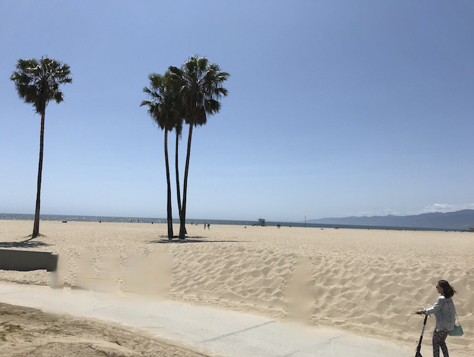
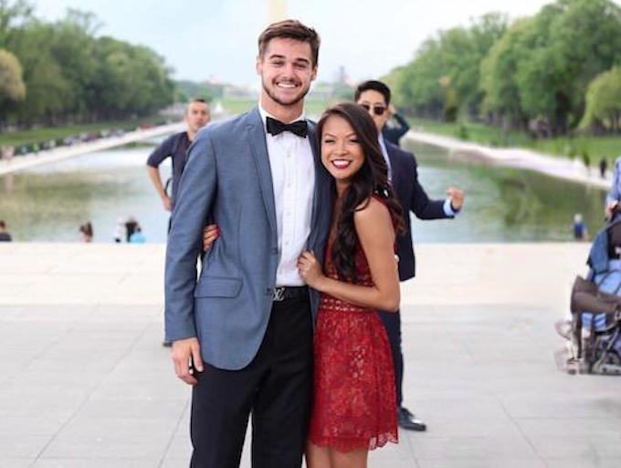
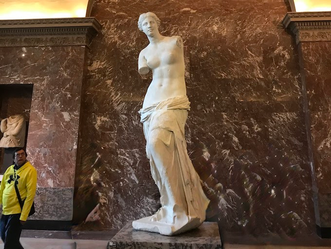
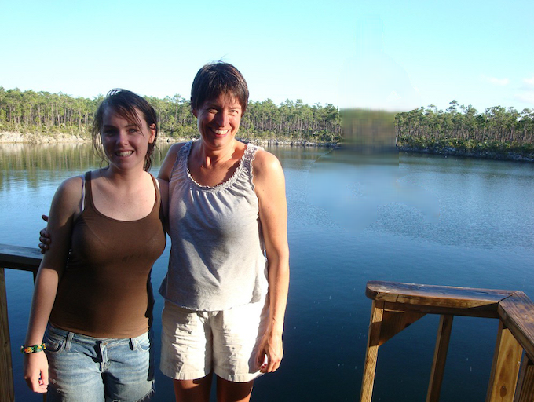

# Deepfill v2 (PyTorch)

## Introduction
This repo is trying to reproduce some results of awesome 
Deepfill v2 ([Project](http://jiahuiyu.com/deepfill) & 
[Code](https://github.com/JiahuiYu/generative_inpainting)) 
because I personally prefer pytorh. Besides, I abuse the 
awesome [detectron2](https://github.com/facebookresearch/detectron2)
lib to implement although it is originally designed for 
object detection, because I appreciate its well-organized codes.
If you know more suitable tools, welcome to give recommendations.  

This repo is yet to be finished and tested. Currently there are 
some bugs to be fixed. Welcome to give a hand.

## Progress
- [x] Build up the model.
- [x] Translate the pretrained tensorflow model into pytorch.
- [ ] Fix the bug in demo, stated below.
- [ ] Evaluate the pretrained model on Places2 and CelebA-HQ.
- [ ] Train the model on Places2 and CelebA-HQ.

## Current Problems
`inpaint_demo.ipynb` tries to produce some examples but got 
a deteriorated results compared to original implementation.
Below are the results, from left to right are masked image, 
inpainted image by this repo, inpainted image by original repo
respectively. It could be noticed that the results produced in
this repo are blurred.

  
  
  
  
  
  
  

## Run Demo
### prerequisites
* Python 3.6
* Pytorch 1.3.0 (**not yet tested for higher version**)
* detectron2 0.1